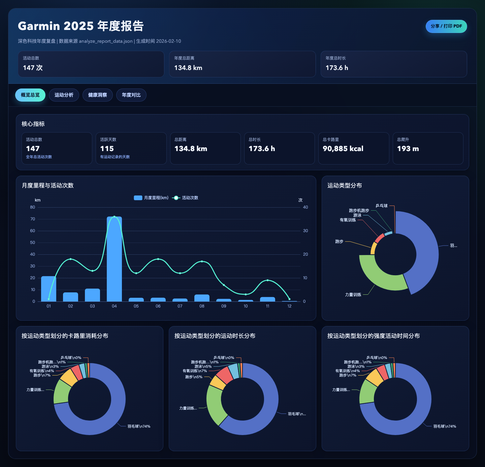
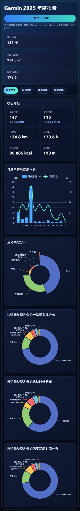
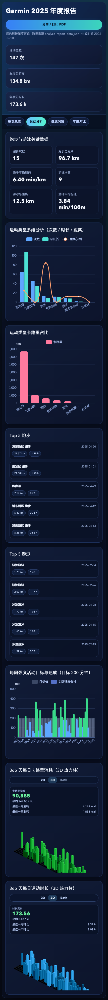
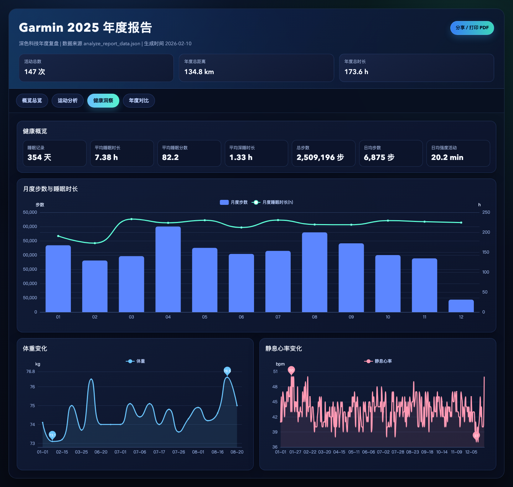
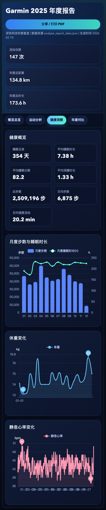
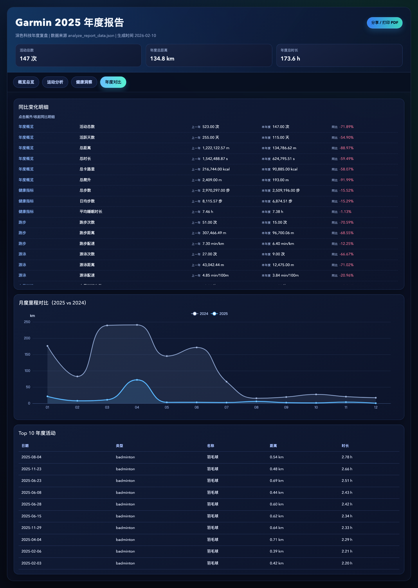
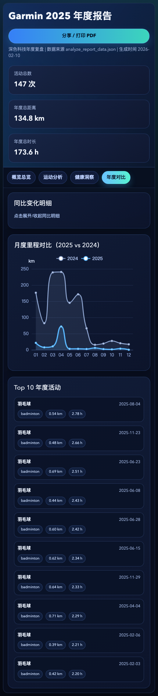

# GarminReport

中文 | English

GarminReport 是一个面向个人年度复盘的 Garmin 数据可视化项目。  
GarminReport is a personal yearly-review dashboard for Garmin data.

它可以把你的活动、健康、睡眠、强度训练等数据生成一个风格化年度报告页面，并支持一键打印/PDF 导出。  
It turns your activities, health, sleep, and intensity metrics into a polished yearly report page with one-click print/PDF export.

## Why This Project | 项目亮点

- 多章节年度报告：概览总览、运动分析、健康洞察、年度对比  
  Multi-section report: Overview, Sports Analysis, Health Insights, Year-over-Year Comparison.
- 深色科技风 UI，支持桌面端与移动端适配  
  Modern dark UI with desktop and mobile responsiveness.
- 强化图表体系：趋势图、类型分布、Top 活动、3D/2D 热力视图  
  Rich charts: trends, type distribution, top activities, and 3D/2D heatmap views.
- 隐私优先：原始 Garmin 数据默认不入库  
  Privacy-first: raw Garmin exports are excluded from version control by default.

## Demo Screenshots | 示例截图

### Overview / 概览总览



### Sports Analysis / 运动分析



### Health Insights / 健康洞察



### Year-over-Year / 年度对比



## Quick Start | 快速开始

### 1) Configure environment / 配置环境

```bash
cp .env.example .env
```

Fill in your Garmin credentials in `.env`:

```env
GARMIN_EMAIL=
GARMIN_PASSWORD=
GARMIN_CN=false
```

### 2) Pull Garmin data / 拉取 Garmin 数据

```bash
python fetch_garmin_data.py --years 2025
```

### 3) Build yearly analysis / 生成年度分析数据

```bash
python analyze_report_data.py --year 2025
```

### 4) Generate report / 生成报告页面

```bash
python generate_report.py --year 2025
```

## Privacy & Safety | 隐私与安全

- `garmin_report_*/` is ignored by default.
- Secrets (`.env`, `*.pem`, `*.key`, `*.p12`) are ignored by default.
- `output/` is ignored except `output/screenshots/*.png` for showcase images.
- Before commit, run:

```bash
scripts/privacy_check_staged.sh
```

## Repo Structure | 目录结构

```text
fetch_garmin_data.py        # Pull raw Garmin data
analyze_report_data.py      # Build yearly aggregated analysis
generate_report.py          # Render final annual report HTML
templates/                  # HTML/CSS/JS templates and assets
tests/                      # Unit tests
output/screenshots/         # Demo screenshots tracked for README
```

## Testing | 测试

```bash
python -m pytest tests -q
```

---

If you are building your own annual review page, this repo gives you both a data pipeline and a polished frontend baseline.  
如果你想做自己的年度运动复盘，这个仓库提供了完整的数据处理链路和可持续迭代的前端模板。
