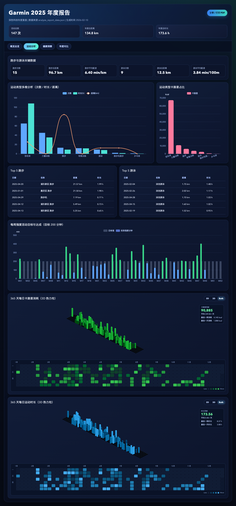

# GarminReport（中文）

语言： [English](README.md) | **中文**

GarminReport 是一个兼顾美观与隐私安全的 Garmin 年度报告项目。  
它可以把活动与健康数据整理成结构化年度页面，支持：

- 概览总览、运动分析、健康洞察、年度对比
- 多种图表与 3D/2D 热力可视化
- 一键打印 / 导出 PDF
- 桌面端与移动端自适应

## 示例截图

运动分析（桌面版）：



## 快速开始

1. 复制环境变量模板：

```bash
cp .env.example .env
```

2. 安装依赖：

```bash
python -m pip install -r requirements.txt
```

3. 在 `.env` 中填写账号：

```env
GARMIN_EMAIL=
GARMIN_PASSWORD=
GARMIN_CN=false
```

4. 拉取数据（至少连续两年，才能做同比）：

```bash
python fetch_garmin_data.py --years 2024,2025
```

如果只拉取一年，分析时上一年对比字段会缺失。

5. 生成分析数据：

```bash
python analyze_report_data.py --year 2025
```

6. 生成报告：

```bash
python generate_report.py --year 2025
```

## 隐私说明

- 默认忽略 `garmin_report_*/` 原始数据目录。
- 默认忽略密钥与环境文件（如 `.env`、`*.pem`、`*.key`、`*.p12`）。
- 默认忽略 `output/`，仅保留 `output/screenshots/*.png` 作为文档示例图。

## 项目结构

```text
requirements.txt            # 运行依赖
requirements-dev.txt        # 开发/测试依赖
fetch_garmin_data.py        # 拉取 Garmin 原始数据
analyze_report_data.py      # 生成年度聚合分析数据
generate_report.py          # 渲染年度报告 HTML
templates/                  # HTML/CSS/JS 模板与资源
tests/                      # 单元测试
output/screenshots/         # README 示例截图
```

## 测试

```bash
python -m pip install -r requirements-dev.txt
python -m pytest tests -q
```
